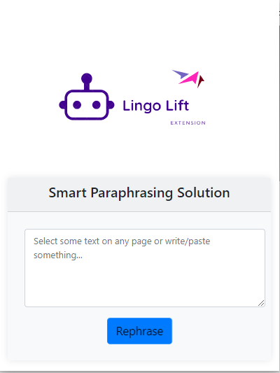

# Lingo Lift - Text Driven Paraphrasing Edge Extension

  

Hi, i made Microsoft Edge extension, which paraphrase text. here is complete details of project. 

## Features

- **Text Paraphrasing**: Lingo Lift utilizes the advanced Pegasus model to intelligently rephrase your text, providing fresh and unique writing alternatives. Say goodbye to repetitive and monotonous content!

- **Keyword Enrichment**: Extracting essential keywords from your text is made easy with Lingo Lift. It uses KeyBERT, a powerful keyword extraction library, to identify important terms that drive the context of your writing.

- **Synonym Suggestions**: To broaden your vocabulary and enhance the variety in your writing, Lingo Lift suggests synonyms for the extracted keywords. This feature utilizes WordNet, a lexical database, to provide you with relevant synonym options.

## How to Use

1. **Download Repo**: Get Lingo Lift from the Microsoft Edge Extension Store and add it to your browser.

1. **Highlight the Text**: Select the text you want to paraphrase or enrich with keywords.

2. **Open Extension**: Click extention text will automatically enter in the extension.

4. **Choose Action**: Select "Paraphrase Text" to rephrase your selection or "Keyword Enrichment" to receive synonym suggestions for the essential keywords.

5. **Experience the Transformation**: Let Lingo Lift do its magic! You'll witness your text transform with fresh phrasing or enriched with synonyms, elevating the quality and impact of your content.

## Compatibility

Lingo Lift is fully compatible with Microsoft Edge browsers, providing a seamless experience across various platforms.

## Contribution

We welcome contributions from the community to make Lingo Lift even better. If you have any suggestions, bug reports, or feature requests, please feel free to open an issue or submit a pull request on our GitHub repository.

## License

Lingo Lift is open-source software released under the [MIT License](LICENSE), granting you the freedom to use, modify, and distribute the extension.

---

_Elevate your writing skills with Lingo Lift! Download the extension today and experience the power of text paraphrasing and keyword enrichment in Microsoft Edge. If you have any questions or feedback, don't hesitate to reach out to us. Happy writing!_
 

HAPPY CODING!

